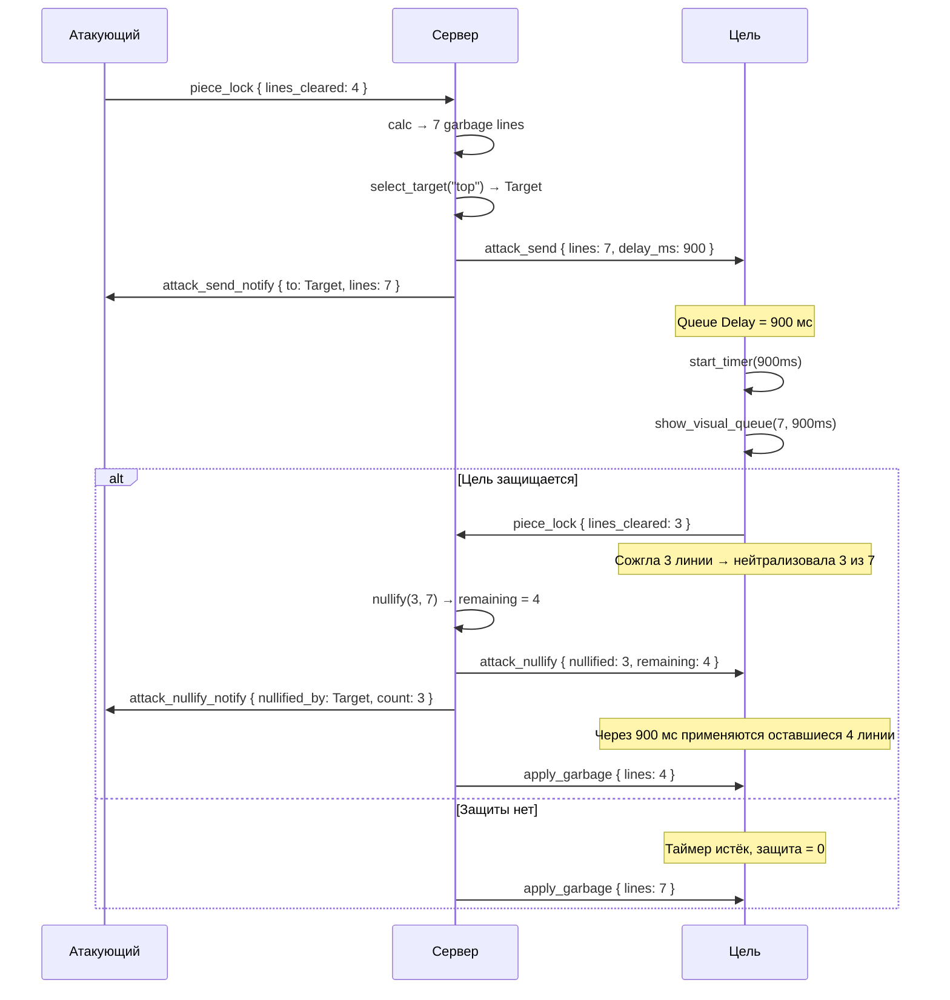
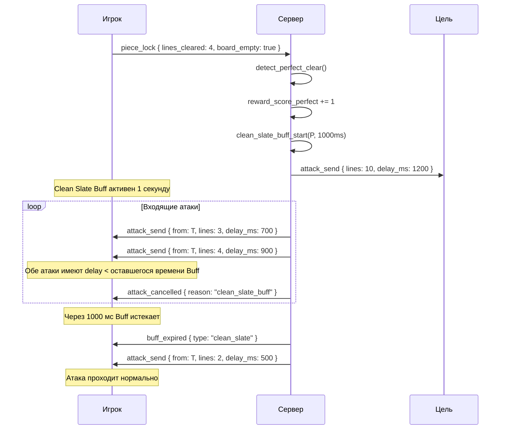

# Sequence Diagrams — Neon Tetris Match Flow

> Все диаграммы в формате Mermaid. Для просмотра используйте любой Mermaid-рендерер (VS Code → Preview, Mermaid Live Editor).

---

## 1. Полный цикл матча (Full Match Loop)

```mermaid
sequenceDiagram
    participant A as Игрок A
    participant S as Сервер
    participant B as Игрок B
    participant C as Игрок C
    participant D as Игрок D

    Note over A,S,B,C,D: ФАЗА ЛОББИ
    A->>S: create_room { league: "shortlist", mode: "top", name: "PvP #1" }
    S->>A: room_created { room_id, invite_code }
    B->>S: join_room { room_id }
    C->>S: join_room { room_id }
    D->>S: join_room { room_id }
    S->>A: room_state { players: [A,B,C,D], status: "lobby" }
    S->>B: room_state { ... }
    S->>C: room_state { ... }
    S->>D: room_state { ... }

    Note over A,S,B,C,D: ФАЗА READY CHECK
    A->>S: player_ready { ready: true }
    S->>B: player_ready { player: A, ready: true }
    B->>S: player_ready { ready: true }
    C->>S: player_ready { ready: true }
    D->>S: player_ready { ready: true }
    S->>A: all_ready { countdown: "starting" }

    Note over A,S,B,C,D: ФАЗА СТАРТА МАТЧА (СИНХРОНИЗАЦИЯ)
    S->>S: generate_seed()
    S->>A: game_start { seed: 0xDEADBEEF, player_index: 0, start_time: 1712345678000, target_mode: "top", league: "shortlist" }
    S->>B: game_start { seed: 0xDEADBEEF, player_index: 1, start_time: 1712345678000, ... }
    S->>C: game_start { seed: 0xDEADBEEF, player_index: 2, start_time: 1712345678000, ... }
    S->>D: game_start { seed: 0xDEADBEEF, player_index: 3, start_time: 1712345678000, ... }

    Note over A,S,B,C,D: ФАЗА ИГРЫ (ЦИКЛ)
    loop Каждый ход
        Note over A,S,B,C,D: Циклическая раздача фигур (global_step)
        S->>A: piece_spawn { global_step: 0, piece: "T" }
        S->>B: piece_spawn { global_step: 1, piece: "J" }
        S->>C: piece_spawn { global_step: 2, piece: "Z" }
        S->>D: piece_spawn { global_step: 3, piece: "I" }
        A->>S: piece_lock { global_step: 0, piece: "T", x: 3, y: 18, rotation: 0, lines_cleared: 1 }
        S->>S: verify_piece(global_step, piece)
        S->>S: calculate_attack(lines_cleared: 1, combo: 1)
        S->>S: select_target(mode: "top") -> B
        S->>B: attack_send { from: A, to: B, lines: 1, delay_ms: 400 }
        B->>B: start_queue_timer(400ms)
    end

    Note over A,S,B,C,D: ФАЗА ЗАЩИТЫ (Garbage Counteract)
    B->>S: piece_lock { ..., lines_cleared: 2 }
    S->>S: calculate_nullify(B, lines: 2, pending_attack_lines: 1)
    S->>B: attack_nullify { player: B, nullified: 1, remaining: 0 }
    S->>A: attack_nullify { player: B, nullified: 1, remaining: 0 }
    S->>A: attack_nullify_notify { target: B, status: "NULLIFIED" }

    Note over A,S,B,C,D: ФАЗА ВЫБЫВАНИЯ / ПЕРЕПОЛНЕНИЯ
    S->>C: attack_send { from: A, to: C, lines: 7, delay_ms: 900 }
    C->>C: queue_timer_expired -> apply_garbage(7)
    C->>C: board_overflow -> game_over
    C->>S: player_dead { reason: "top_out" }
    S->>A: player_eliminated { player: C }
    S->>B: player_eliminated { player: C }
    S->>D: player_eliminated { player: C }
    Note over S: alive_players = [A, B, D]

    Note over A,S,B,C,D: ФАЗА ЗАВЕРШЕНИЯ МАТЧА
    S->>S: check_winner(alive: [A, B, D])
    alt Shortlist Mode
        Note over S: Последний выживший
        D->>S: piece_lock { ... }
        S->>S: D -> board_overflow
        S->>A: game_over { winner: A, reason: "last_standing", scores: {...} }
        S->>B: game_over { winner: A, reason: "last_standing", scores: {...} }
        S->>D: game_over { winner: A, reason: "last_standing", scores: {...} }
    else BO4 Mode (последний раунд)
        S->>A: game_over { round: 4, winner: D, match_winner: D, scores: {...} }
        S->>B: game_over { round: 4, winner: D, match_winner: D, scores: {...} }
        S->>C: game_over { round: 4, winner: D, match_winner: D, scores: {...} }
        S->>D: game_over { round: 4, winner: D, match_winner: D, scores: {...} }
    end

    Note over A,S,B,C,D: ФАЗА РЕЗУЛЬТАТОВ
    S->>A: match_result { winner, leaderboard, stats, rating_change }
    S->>B: match_result { ... }
    S->>C: match_result { ... }
    S->>D: match_result { ... }
```

---

## 2. Раздача фигур (7-Bag Cyclic Deal)

```mermaid
sequenceDiagram
    participant S as Сервер (Seed: 0xDEADBEEF)
    participant A as Игрок A (idx 0)
    participant B as Игрок B (idx 1)
    participant C as Игрок C (idx 2)
    participant D as Игрок D (idx 3)

    Note over S: Bag #1 shuffles [I, O, T, S, Z, J, L] → [Z, J, O, I, L, T, S]

    S->>A: global_step 0 → Z
    S->>B: global_step 1 → J
    S->>C: global_step 2 → O
    S->>D: global_step 3 → I
    S->>A: global_step 4 → L
    S->>B: global_step 5 → T
    S->>C: global_step 6 → S
    Note over S: Bag #1 исчерпан

    Note over S: Bag #2 shuffles → [S, L, J, T, O, I, Z]

    S->>D: global_step 7 → S
    S->>A: global_step 8 → L
    S->>B: global_step 9 → J
    S->>C: global_step 10 → T
    S->>D: global_step 11 → O
    S->>A: global_step 12 → I
    S->>B: global_step 13 → Z

    Note over S: И так далее. Каждый игрок видит одну и ту же ленту фигур
    Note over A,B,C,D: (но "ловит" свою по индексу global_step % 4 == player_index)
```

---

## 3. Queue Delay + Garbage Counteract (детально)



---

## 4. Perfect Clear + Clean Slate Buff



---

## 5. Ready Check Timeout Flow

```mermaid
sequenceDiagram
    participant Host as Хост
    participant S as Сервер
    participant P1 as Игрок A
    participant P2 as Игрок B
    participant P3 as Игрок C

    Note over Host,S,P1,P2,P3: Комната заполнена (4/4)
    S->>Host: room_full { players: 4, ready_check_started: true }
    S->>P1: ready_check_started { timeout_sec: 60 }
    S->>P2: ready_check_started { timeout_sec: 60 }
    S->>P3: ready_check_started { timeout_sec: 60 }

    P1->>S: player_ready { ready: true }
    P2->>S: player_ready { ready: true }

    Note over S: 55 секунд прошло, P3 всё ещё не готов
    S->>Host: ready_check_timeout_approaching { waiting_for: [P3], time_left_sec: 5 }

    alt Хост принудительно стартует
        Host->>S: force_start { room_id }
        S->>P1: game_start { seed, ... }
        S->>P2: game_start { seed, ... }
        S->>P3: game_start { seed, ... }
        Note over P3: P3 получает тот же game_start, но без статуса "ready"
    else Все нажали готов
        P3->>S: player_ready { ready: true }
        S->>S: all_ready → start_match()
    end
```