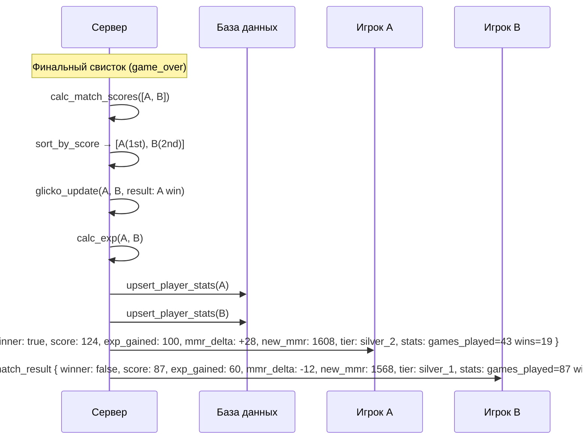

# Rating & ELO System — Neon Tetris

> Дополнение к GDD: система подсчёта очков, опыт (EXP), рейтинг (MMR/ELO) и подбор игроков.

---

## 1. Очки матча (Match Score)

### 1.1. Источники очков

| Действие | Очки | Кому |
|----------|:---:|------|
| Сожжена 1 линия | 1 | Себе |
| Сожжены 2 линии | 3 | Себе |
| Сожжены 3 линии | 6 | Себе |
| Сожжены 4 линии (Tetris) | 12 | Себе |
| Perfect Clear | +15 бонус | Себе |
| Нейтрализация атаки | +2 за каждую нейтрализованную линию | Себе |
| Выживание (тик 10 сек) | +1每 10 секунд | Себе |
| Победа в матче | +50 | Победителю |
| Elimination (убил/выбил соперника) | +20 (если ты причина top-out) | Атакующему (дополнительно к обычным очкам) |

### 1.2. Формула матчевых очков

```
MatchScore = ClearScore + PerfectBonus + NullifyScore + SurvivalScore + WinBonus + ElimBonus
```

Где:
- `ClearScore` — сумма очков за линии (см. таблицу выше).
- `PerfectBonus` — `15 × number_of_perfect_clears`.
- `NullifyScore` — `2 × total_lines_nullified`.
- `SurvivalScore` — `floor(duration_seconds / 10)`.
- `WinBonus` — `50` если победил, иначе `0`.
- `ElimBonus` — `20 × eliminations_caused`.

---

## 2. Система EXP (опыт / уровень)

### 2.1. EXP за матч

| Место в матче | EXP | Условие |
|:---:|:---:|---------|
| 🥇 1-е | 100 | Победитель |
| 🥈 2-е | 60 | Проигравший, но живой |
| 🥉 3-е | 30 | Проигравший, выбыл |
| 4-е | 10 | Выбыл первым |

**Дополнительный EXP:**
- `+10` за каждый Perfect Clear.
- `+5` если матч длился > 2 минут (выживалка).

### 2.2. Уровни

```
Уровень 1:     0 EXP
Уровень 2:   100 EXP
Уровень 3:   300 EXP
Уровень 4:   600 EXP
Уровень 5:  1000 EXP
...
Уровень n:   EXP_needed(n) = 100 × n × (1 + 0.15 × n)   // кривая роста
```

- EXP растёт нелинейно, чтобы замедлить прокачку на высоких уровнях.
- Уровень нужен **только для косметики** (фреймы, иконки, цвета ника).
- Уровень **не влияет** на подбор соперников (MMR работает отдельно).

---

## 3. Система MMR / ELO (Matchmaking Rating)

### 3.1. База

Система — **модифицированный Glicko-2** (аналогично Tetr.io,但不是原始ELO). Адаптирована под мультиплеер Free-For-All (4 игрока).

### 3.2. Входные параметры

| Параметр | Начальное значение |
|----------|:---:|
| `MMR` | 1500 (новый игрок) |
| `RD` (Rating Deviation) | 350 (высокая неопределённость) |
| `σ` (Volatility) | 0.06 |

### 3.3. Расчёт для 4 игроков (FFA)

После каждого матча обновляются рейтинги всех участников.

**Ожидаемый рейтинг (Expected Score):**

Для FFA используется **Plackett-Luce model** (модель ранжирования):

```
P(player_i финиширует на месте r) = exp(MMR_i / 400) / sum(exp(MMR_j / 400) for j in alive_players)
```

Упрощённо (для реализации на бэкенде):

1. Игроки сортируются **по финальным очкам** (MatchScore).
2. Каждому игроку назначается `S = 1.0` (победа) или `S = 0.0` (поражение).
   - В FFA 4 игрока: 1-е место → `S = 1.0`, 2-е → `S = 0.5`, 3-е → `S = 0.0`.
   - Выбывший раньше времени → `S = 0.0` (вне зависимости от очков, т.к. проиграл).
3. Дельта MMR:

```
Expected = 1 / (1 + 10^((MMR_opponent - MMR_player) / 400))
K = 32  // базовый коэффициент
MMR_delta = K × (S - Expected)
```

### 3.4. Модификации для 1v1

В режиме Heads-up (1v1) используется **классический ELO**:

```
Expected_A = 1 / (1 + 10^((MMR_B - MMR_A) / 400))
K = 48  // выше K для 1v1 — больше волатильности
MMR_A_new = MMR_A + K × (result_A - Expected_A)
// result_A: 1.0 победа, 0.0 поражение
```

### 3.5. Разброс RD (Glicko-2 упрощённый)

```
После матча:
  RD' = sqrt(RD² + σ² × t)   // t — время с последнего матча в днях
  RD_new = 1 / sqrt(1/RD'² + 1/d²)  // d — константа (350)
  
Если RD > 350 → поставить в очередь с ветеранами (не матчить с новичками).
Если RD < 100 → рейтинг стабилен.
```

### 3.6. K-фактор по режимам

| Режим | K | Max change per match |
|-------|:---:|:---:|
| Heads-up (1v1) | 48 | ±48 |
| Shortlist (4 игрока) | 32 | ±32 |
| BO4 (матч из раундов) | 24 per round | ±24 per round |

---

## 4. Подбор игроков (Matchmaking)

### 4.1. Логика поиска

```
1. Игрок выбирает лигу (heads-up / shortlist / bo4).
2. Игрок нажимает "Найти матч".
3. Сервер помещает игрока в очередь поиска:
   {
     player_id,
     mmr: текущий MMR,
     rd: текущий RD,
     mode: "1v1" | "shortlist" | "bo4",
     target_mode: "top" | "all" | "random" (предпочтение, опционально),
     joined_at: timestamp
   }
4. Каждые 2 секунды сервер сканирует очередь:
   - Ищет других игроков того же режима.
   - Вычисляет "score" = abs(MMR_A - MMR_B).
   - Если score < 200 + (RD_A + RD_B) / 2 * 0.5:
       → предлагает матч (pre-match popup).
   - Иначе ждёт.
5. Если в очереди > 30 секунд:
   → расширяет допуск: score < 400 + (RD_A + RD_B) * 0.5.
6. Если в очереди > 60 секунд:
   → допуск бесконечный (матч с любым).
```

### 4.2. Pre-Match Popup

```
Игрок получает:
  {
    type: "match_found",
    opponent_mmr: [1580, 1520, ...],
    estimated_wait: 5s,
    timeout_sec: 10
  }

На экране (анимированно):
  ┌──────────────────────────┐
  │     МАТЧ НАЙДЕН!         │
  │                          │
  │  Neo#2312 (1480 MMR)     │
  │  vs                      │
  │  Z-Tet#819 (1520 MMR)    │
  │                          │
  │  ⏳ Подтверждение 8 сек   │
  │                          │
  │  [Готов] [Отменить]      │
  └──────────────────────────┘
```

### 4.3. Режимы, которые не матчатся друг с другом

| Группа | Комментарий |
|--------|-------------|
| Heads-up | Только друг с другом |
| Shortlist | Только друг с другом (4 игрока) |
| BO4 | Только друг с другом |

Целевые режимы атаки (top/all/random) — **не разделяют очередь**. Игрок может выбрать предпочтение, но если матч собирается быстрее с другим режимом — применяется режим хоста комнаты.

---

## 5. Таблица рангов (Tiers)

Визуальные ранги, основанные на MMR:

| Ранг | MMR (min) | MMR (max) | Иконка |
|------|:---:|:---:|:---:|
| 🟢 Бронза I | 0 | 1199 | 🥉 |
| 🟢 Бронза II | 1200 | 1399 | 🥉★ |
| 🟡 Серебро I | 1400 | 1599 | 🥈 |
| 🟡 Серебро II | 1600 | 1799 | 🥈★ |
| 🟠 Золото I | 1800 | 1999 | 🥇 |
| 🟠 Золото II | 2000 | 2199 | 🥇★ |
| 🔴 Платина | 2200 | 2499 | 💎 |
| 🟣 Элита | 2500 | 2999 | 🔮 |
| 🟢🔫 Неон | 3000+ | ∞ | 💠 (анимированный) |

- Ранг определяется **текущим MMR**. При падении MMR ниже порога ранг понижается.
- Сброс ранга в начале сезона (опционально): MMR сдвигается к 1500 на 50%.

---

## 6. Хранение данных

```json
{
  "player_id": "uuid",
  "nickname": "Neo#2312",
  "stats": {
    "mmr": 1580,
    "rd": 120,
    "sigma": 0.06,
    "peak_mmr": 1720,
    "tier": "silver_1",
    "exp": 450,
    "level": 5,
    "games_played": 42,
    "wins": 18,
    "total_lines_cleared": 1024,
    "perfect_clears": 7,
    "total_attacks_sent": 256,
    "total_attacks_nullified": 88,
    "best_score": 152
  },
  "last_match_at": "2026-04-10T14:00:00Z"
}
```

---

## 7. Поток данных рейтинга (после матча)

